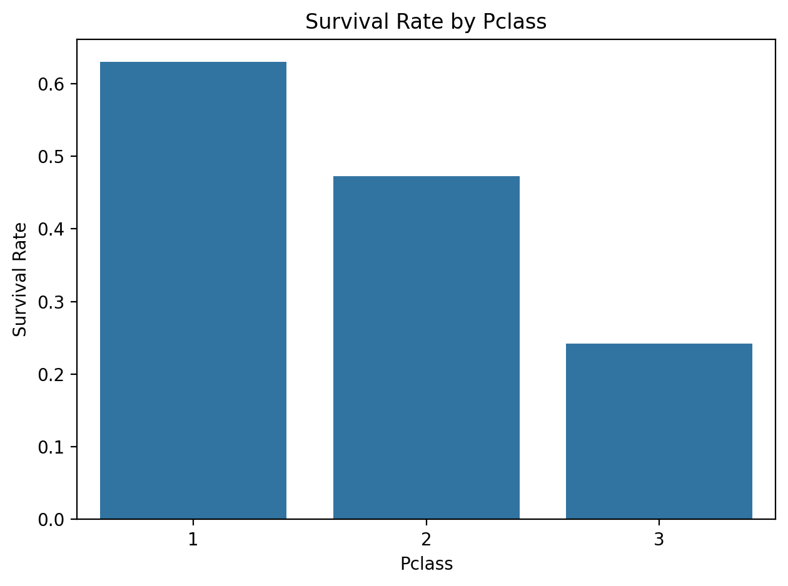
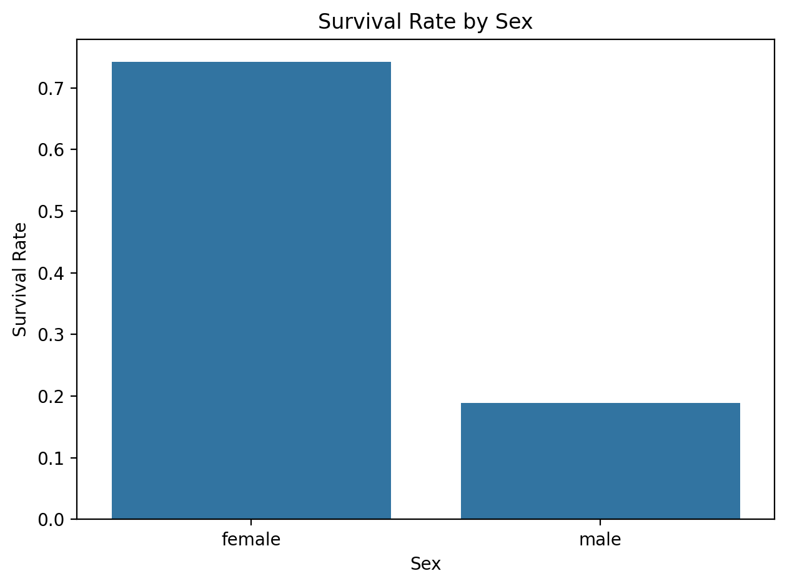
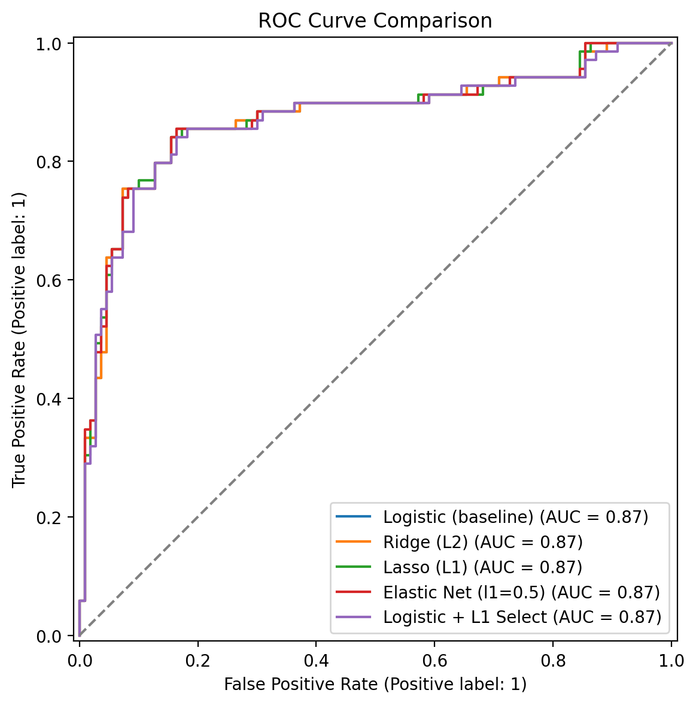

🚢 Titanic Survival Prediction

  
  

📌 Abstract

This project applies Linear and Logistic Regression with Regularization (Ridge, Lasso, Elastic Net) and Stepwise Feature Selection to the Titanic dataset.
After thorough data cleaning, feature engineering, and model evaluation, the best performance was achieved with Elastic Net Logistic Regression (ROC-AUC = 0.872).
## 📂 Project Structure

├── data/ # Raw and processed datasets
├── notebooks/ # Jupyter notebooks for analysis
├── reports/ # Final report (PDF) and visualizations
├── models/ # Saved ML pipelines
├── src/ # Source code (data cleaning, prediction scripts)
├── requirements.txt
└── README.md # Project documentation

📊 Dataset

Source: Titanic Kaggle Competition

Features engineered:

FamilySize, IsAlone, Title, AgeBin, FareBin

Target: Survived (0 = No, 1 = Yes)

⚙️ Installation

Clone the repo and install dependencies:

git clone <repo_url>
cd titanic-regression
pip install -r requirements.txt

🚀 Usage

Open notebooks in the following order:

01_cleaning.ipynb

02_eda.ipynb

03_modeling.ipyng

Eda_Report.ipynb

Final_Report.ipynb

Run the scripts to reproduce results.

| Model               | Accuracy | Precision | Recall   | F1       | ROC-AUC   |
| ------------------- | -------- | --------- | -------- | -------- | --------- |
| Logistic Regression | 0.81     | 0.79      | 0.74     | 0.76     | 0.84      |
| Ridge Regression    | 0.82     | 0.80      | 0.75     | 0.77     | 0.85      |
| Lasso Regression    | 0.81     | 0.78      | 0.73     | 0.75     | 0.84      |
| **Elastic Net**     | **0.84** | **0.82**  | **0.78** | **0.80** | **0.872** |

Key predictors: Sex, Pclass, Title, FamilySize, IsAlone

📊 Visualizations

Survival distribution by Class  

Survival distribution by Sex 

ROC Curves (All Models)  

Feature Importance (Elastic Net)
(Included in reports section)

📜 License

This project is licensed under the MIT License.

🤝 Contribution

Pull requests are welcome! For major changes, please open an issue first to discuss what you’d like to change.
